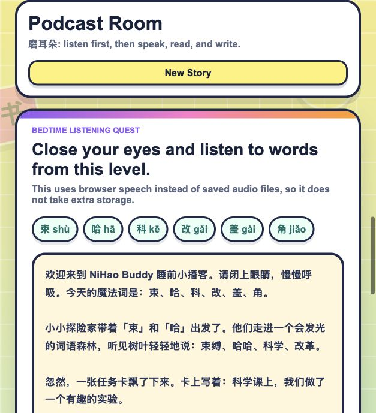

# NiHao Buddy 🇨🇳📚

### My First AI-Assisted Educational Technology Project

## Project Overview

NiHao Buddy is an experimental Chinese learning application inspired by my own learning journey.

I enjoy technology, coding, and building things, but I found Chinese more challenging than some of my other subjects. My mum noticed this and encouraged me to think about how technology could make Chinese learning more effective and enjoyable.

Together, we brainstormed ideas for a Chinese learning app that could help not only me, but also my younger sister and other students who may struggle with Chinese.

This became my first AI-assisted software development project and my introduction to using technology to solve real learning problems.

---

## How the Idea Started

Many students find Chinese difficult because learning vocabulary can feel repetitive and sometimes less engaging.

My mum and I discussed what makes games enjoyable and what helps people remember information better. We wondered if learning Chinese could be made more fun through technology.

We came up with ideas such as:

- Interactive quizzes
- Flashcards
- Rewards and achievements
- Learning streaks
- Progress tracking
- Audio pronunciation support
- Vocabulary stories
- Personalised review based on mistakes
- Fun challenges and mini-games

We then explored whether these ideas could be combined into a learning app that makes Chinese practice more engaging and motivating.

---

## Project Vision

The long-term vision of NiHao Buddy is to create a learning companion that helps students:

- Build Chinese vocabulary confidently
- Review words more effectively
- Learn through games and challenges
- Stay motivated through rewards and achievements
- Practice pronunciation and pinyin
- Learn from their mistakes
- Develop consistent learning habits

The goal is not only to teach Chinese, but also to make learning feel enjoyable and rewarding.

---

## Current Prototype

The current prototype explores several learning features, including:

- Vocabulary learning
- Flashcard-style revision
- Chinese words with pinyin and meanings
- Quiz-based learning activities
- Educational user interface design
- AI-assisted content and feature development

As this was my first software project, the prototype is still a work in progress and many ideas remain under development.

---

## What Was Built

The current prototype includes:

- P1 to P6 Chinese vocabulary practice
- Flashcards with Chinese characters, pinyin, meanings, useful phrases, and good sentences
- Audio support using browser speech and external sound links
- Podcast Room for 磨耳朵 listening practice, using browser speech to read Chinese stories containing current vocabulary words
- More engaging bedtime-style listening stories with child-friendly pacing, higher-pitched browser speech, and repeated vocabulary exposure
- External Mandarin story podcast links for extra bedtime listening without storing large audio files locally
- Quiz-based learning to test recognition of Chinese characters
- Points, rewards, badges, streaks, and progress tracking
- Working mission progress cards for word learning, quiz practice, speed challenge, and listening practice
- A mistake review system that helps students revise words they got wrong
- A personal vocabulary collection for saving useful words
- Recommended revision based on saved words and quiz mistakes
- A speed challenge mini-game for quick vocabulary practice
- A colourful gamified web app interface with quest-style navigation, XP progress cards, badges, and a Buddy Bot mascot

This working prototype helped me turn my original idea into something that can be tested, improved, and explained. It shows how I used coding and AI-assisted development to solve a real learning problem from my own life.

---

## Podcast Room

I added a Podcast Room because language learning starts with listening. Before students can speak, read, and write well, they need to hear the language many times, similar to how babies first learn by listening and copying.

The Podcast Room creates short Chinese listening stories using words from the selected P1 to P6 vocabulary level. Students can close their eyes and listen to the story being read aloud by the browser. The app chooses a Chinese browser voice when available and uses a slightly higher pitch with slower pacing to make the story sound more child-friendly. This supports 磨耳朵 practice and can also be used at bedtime, so learning can continue in a relaxed way.

To avoid making the project too large, the app does not store audio files locally. It uses browser speech for the built-in story reading feature and includes links to publicly available Mandarin story podcasts for extra listening practice:

- [Chinese Short Stories for Kids - Adventures with Ollie](https://podcasts.apple.com/us/podcast/chinese-short-stories-for-kids-adventures-with-ollie/id1581310942)
- [Chinese Stories For Kids | Bedtime Stories | Exploart Podcast](https://podcasts.apple.com/us/podcast/chinese-stories-for-kids-bedtime-stories-exploart-podcast/id1736546686)
- [The ABC Storytime Podcast](https://podcasts.apple.com/us/podcast/the-abc-storytime-podcast/id1546174165)

---

## Future Ideas

### Learning Features

- Grade-level vocabulary lists
- Example sentences
- Pronunciation audio
- Personal vocabulary collections
- Mistake review system

### Gamification Features

- Points and rewards
- Achievement badges
- Daily learning streaks
- Progress levels
- Unlockable content
- Learning challenges
- Mini-games based on vocabulary learning

### Personalised Learning

- Progress tracking
- Recommended revision topics
- Spaced repetition review
- Personal learning statistics

### Creative Features

- Vocabulary stories
- Interactive learning adventures
- Character-based rewards
- Story-based revision activities

### Family Learning

- Multiple user profiles
- Shared family learning progress
- Parent support tools

---

## Technologies Explored

- HTML
- CSS
- JavaScript
- Python (planned exploration)
- AI-assisted development tools

---

## My Development Process

I used AI extensively throughout the project.

AI helped generate code, suggest features, and explore possible solutions.

My role included:

- Identifying the learning problem
- Brainstorming ideas with my mum
- Planning features
- Testing the application
- Evaluating AI-generated solutions
- Improving the user experience
- Learning how software projects are built

This project taught me that building useful software requires much more than writing code. It also involves understanding users, solving problems, and continuously improving ideas.

---

## What I Learned

Through this project, I learned:

- How software projects begin with real-world problems
- How AI can assist software development
- How difficult it is to turn ideas into working products
- The importance of testing and iteration
- How educational technology can help learners
- How large projects can become more complex over time

Most importantly, I learned that even unfinished projects can teach valuable lessons.

---

## Current Status

🚧 Work in Progress

NiHao Buddy remains an ongoing learning project.

Although many of the original ideas have not yet been fully implemented, this project sparked my interest in educational technology, AI-assisted development, and software design.

It continues to inspire many of my later coding projects and experiments.

---

## Acknowledgement

Special thanks to my mum for brainstorming ideas, providing feedback, encouraging experimentation, and helping shape the vision behind this project.

This project reflects our shared belief that learning can be more effective when it is engaging, interactive, and enjoyable.
